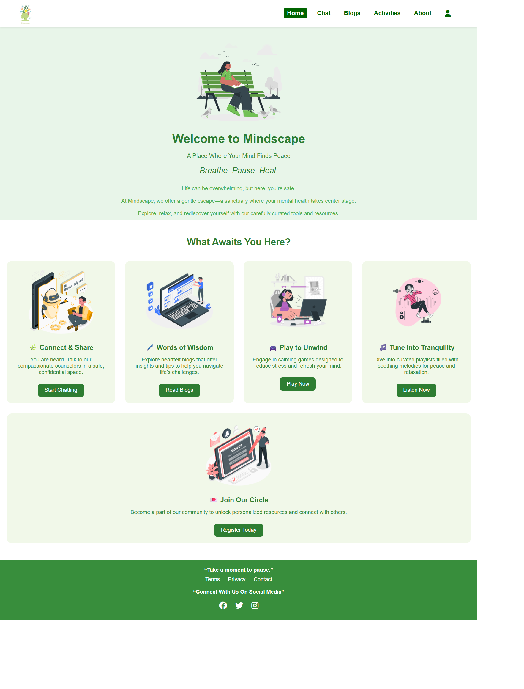
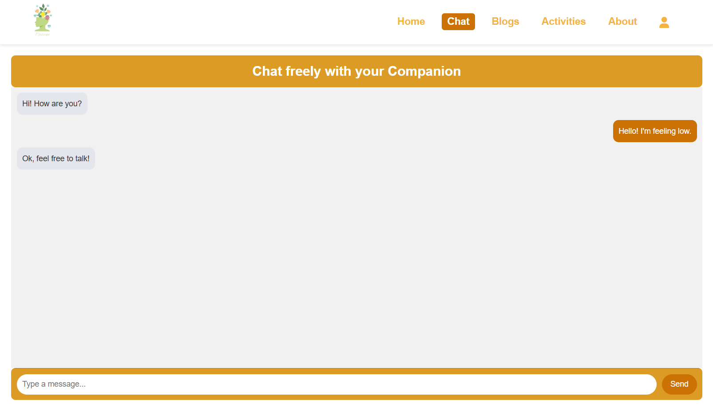
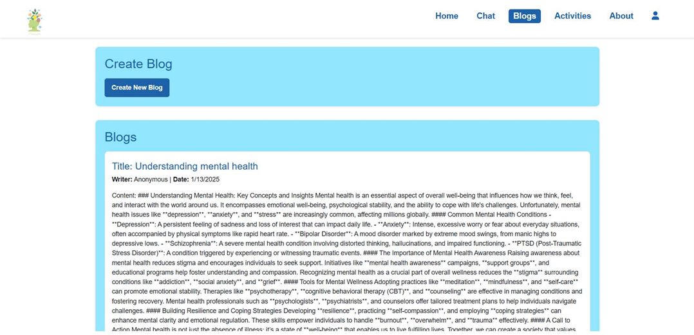
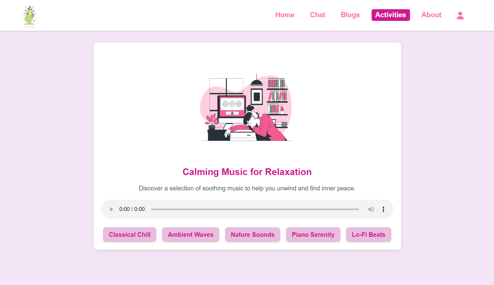
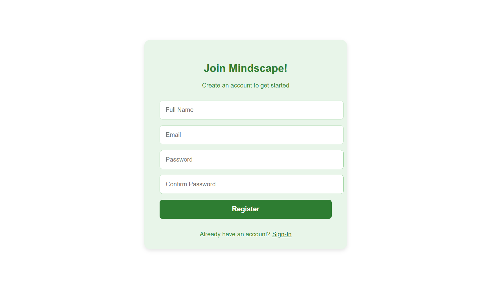

# 🧠 Mindscape – Mental Health Support & Wellness Platform

**Mindscape** is a user-centric mental health and wellness web platform designed to promote emotional well-being, reduce stress, and foster a supportive online community. The system integrates modern technologies and inclusive design principles to provide accessible, secure, and meaningful mental health support for users from diverse backgrounds.

---

## 🎯 Project Objective

The primary goal of Mindscape is to address limitations of existing mental health platforms by offering an **inclusive, interactive, and innovative solution** that encourages active user participation while ensuring privacy, security, and emotional safety.

---

## 🚀 Proposed System Overview

Mindscape focuses on providing multiple features that collectively support mental well-being and stress management.

---

## 🧩 Key Features

### 🤖 Chatbot Assistance
- AI-powered chatbot providing **real-time emotional support**
- Uses **Natural Language Processing (NLP)** for empathetic interactions
- Offers practical coping strategies during stressful moments

---

### ✍️ Inclusive Content Blog Section
- Users can share experiences related to mental health and personal growth
- Encourages supportive and judgment-free discussions
- Builds a strong community through shared stories

---

### 🎮 Relaxation-Focused Game Section
- Interactive games designed to reduce stress and enhance focus
- Includes mindfulness activities, puzzles, and relaxation exercises

---

### 🎵 Calming Music Section
- Collection of soothing music and soundscapes
- Helps users relax based on mood and emotional state

---

### 🎨 User-Friendly and Inclusive Design
- Simple and intuitive interface
- Accessible to users from all backgrounds
- Supports diverse user preferences and experiences

---

### 🔐 Robust Security and Privacy
- Secure authentication and encrypted data storage
- Ensures anonymity and confidentiality
- Provides a safe environment for users

---

### 📈 Scalable and Adaptive Framework
- Supports increasing user base
- Easily adaptable to new technologies and features

---

### 📊 Real-Time Insights and Analytics
- Tracks user interactions
- Helps improve platform features continuously

---

### 🔄 Continuous Innovation
- Regular feature updates based on feedback and trends
- Ensures long-term effectiveness

---

## 📸 Screenshots

> Below are some key screenshots of the Mindscape platform showcasing its features and user interface.

### 🏠 Home Page

---

### 🤖 Chatbot Assistance

---

### ✍️ Blog Section

---

### 🎮 Relaxation Games

---

### 🎵 Calming Music Section

---

### 👤 User Registration Section

---

## 🛠️ Technology Stack *(Update if needed)*

**Frontend**
- HTML
- CSS
- JavaScript

**Database**
MySQL

---

## 🎯 Impact & Benefits
- Encourages open mental health conversations
- Reduces stigma
- Provides stress-relief tools
- Builds a supportive digital community

---

## 🏫 Academic Information

**Project Name:** Mindscape – Mental Health Improver Website  
**Institute:** Finolex Academy of Management and Technology, Ratnagiri  
**Course:** Master of Computer Application (MCA)

---

## 👩‍💻 Developer
**Tanvi Rajaram Mane**

---

## 🌟 Conclusion

Mindscape combines empathy with technology to provide a safe, inclusive, and supportive platform that empowers users to improve their mental well-being.
